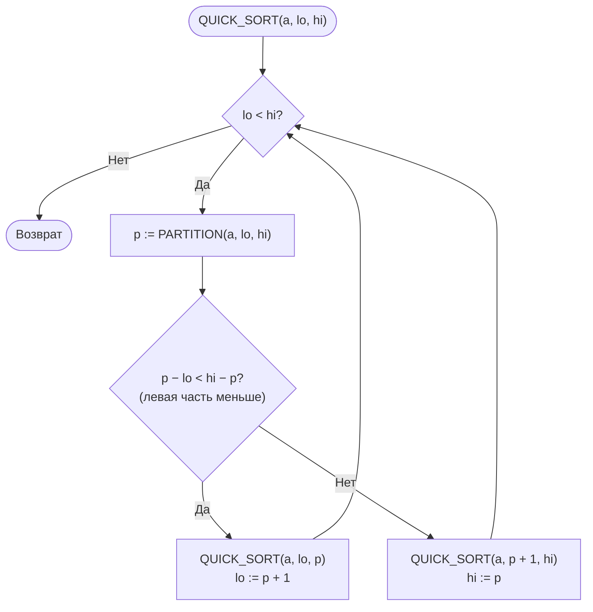
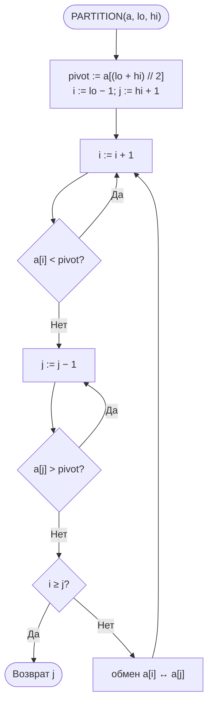
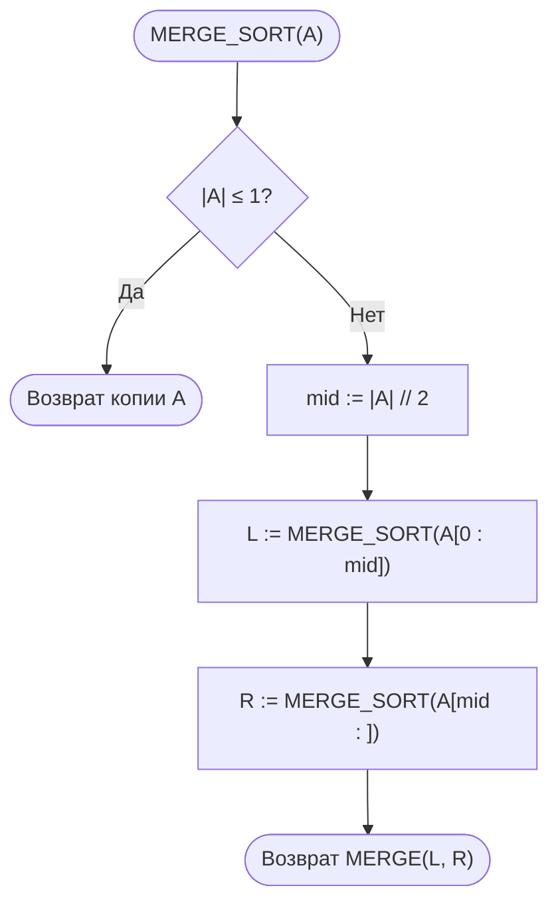
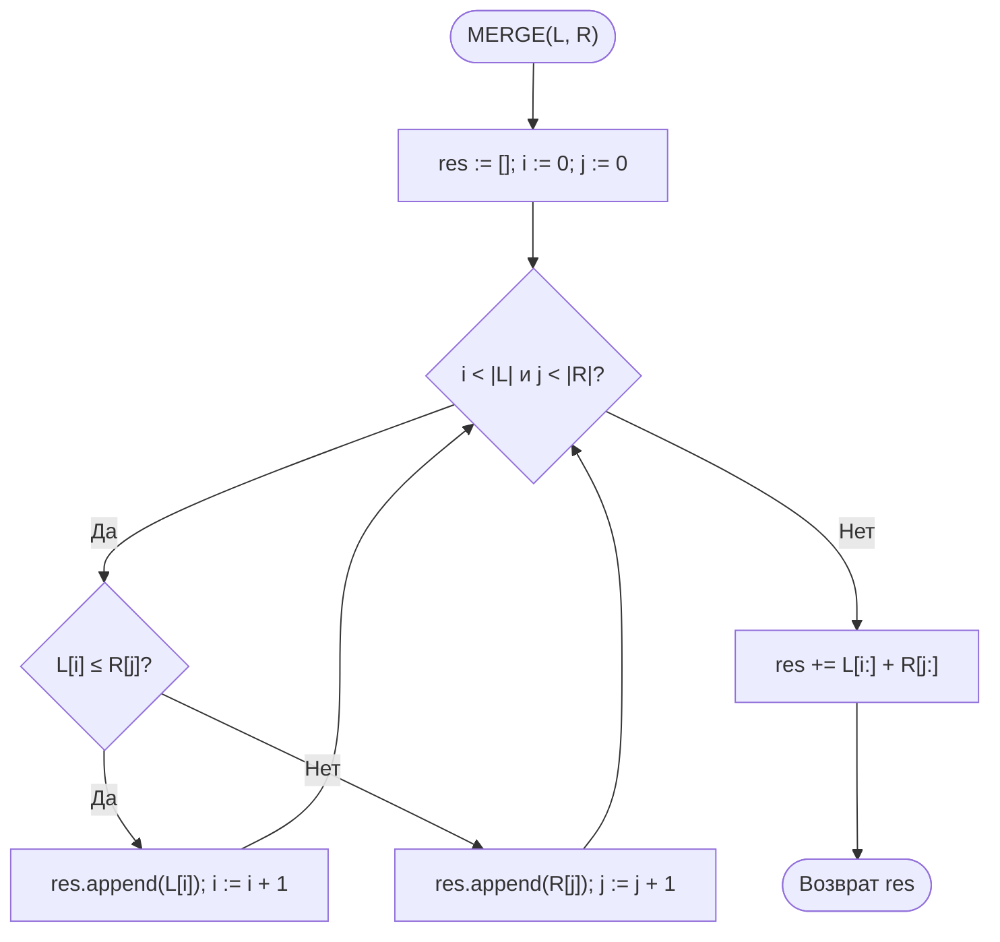

# Лабораторная работа № 3

## Эмпирический анализ временной сложности алгоритмов сортировки. Часть 2: алгоритмы на основе парадигмы «разделяй и властвуй» (быстрая сортировка и сортировка слиянием)

**Дисциплина:** Теория алгоритмов
**Направление подготовки:** 38.03.05 «Бизнес-информатика»
**Курс:** 2
**Объём:** 4 академических часа
**Язык реализации:** Python 3.10+
**Предварительные требования:** выполненная лабораторная работа № 2 (функции `bubble_sort`, `insertion_sort`, модуль `sorts_common.py`)

---

## 1. Цель и задачи работы

**Цель работы:** изучить рекурсивные алгоритмы сортировки, построенные по принципу «разделяй и властвуй», экспериментально подтвердить их сложность $O(n \log n)$ и провести сравнительный анализ с квадратичными алгоритмами из лабораторной работы № 2.

**Задачи:**

1. Изучить парадигму «разделяй и властвуй» и метод анализа рекуррентных соотношений.
2. Реализовать быструю сортировку (Quick Sort) и сортировку слиянием (Merge Sort).
3. Сравнить четыре алгоритма (пузырьком, вставками, быструю, слиянием) на общем наборе размеров.
4. Сравнить быструю сортировку и сортировку слиянием между собой на больших массивах и на данных различной структуры, используя встроенную функцию `sorted()` как эталон.
5. Исследовать влияние выбора опорного элемента на производительность быстрой сортировки.

---

## 2. Теоретическая часть

### 2.1. Парадигма «разделяй и властвуй»

Метод «разделяй и властвуй» (divide and conquer) предполагает решение задачи в три этапа [1]:

1. **Разделение** — задача разбивается на несколько подзадач меньшего размера того же типа.
2. **Властвование** — подзадачи решаются рекурсивно. Достаточно малые подзадачи решаются непосредственно (*базовый случай рекурсии*).
3. **Комбинирование** — решения подзадач объединяются в решение исходной задачи.

Трудоёмкость таких алгоритмов описывается **рекуррентным соотношением**

$$T(n) = a \cdot T\!\left(\frac{n}{b}\right) + f(n),$$

где $a$ — число подзадач, $n/b$ — размер каждой из них, $f(n)$ — затраты на разделение и комбинирование. Для алгоритмов, делящих задачу пополам ($a = b = 2$) с линейными затратами $f(n) = \Theta(n)$, решение рекуррентности (по основной теореме, master theorem) даёт

$$T(n) = \Theta(n \log n).$$

Интуитивно: дерево рекурсии имеет $\approx \log_2 n$ уровней, и на каждом уровне суммарно выполняется $\Theta(n)$ операций.

### 2.2. Нижняя оценка для сортировок сравнением

Любой алгоритм, упорядочивающий элементы только с помощью попарных сравнений, в худшем случае выполняет $\Omega(n \log n)$ сравнений. Это следует из модели дерева решений: у дерева должно быть не менее $n!$ листьев, поэтому его высота не меньше $\log_2(n!) = \Theta(n \log n)$ [1, 2]. Следовательно, сортировка слиянием **асимптотически оптимальна** среди сортировок сравнением.

### 2.3. Сортировка слиянием (Merge Sort)

Алгоритм предложен Дж. фон Нейманом в 1945 г.

- **Разделение:** массив делится пополам.
- **Властвование:** каждая половина сортируется рекурсивно; массив из 0 или 1 элемента считается упорядоченным.
- **Комбинирование:** две упорядоченные половины **сливаются** в один упорядоченный массив за $\Theta(n)$.

**Слияние.** Два указателя движутся по левому и правому подмассивам. На каждом шаге меньший из текущих элементов переносится в результат. Когда один подмассив исчерпан, остаток другого копируется целиком. Использование нестрогого сравнения `left[i] <= right[j]` обеспечивает **устойчивость** сортировки.

**Псевдокод:**

```
MERGE-SORT(A)
1  if |A| ≤ 1
2      return A
3  mid = ⌊|A| / 2⌋
4  L = MERGE-SORT(A[1..mid])
5  R = MERGE-SORT(A[mid+1..n])
6  return MERGE(L, R)
```

**Рекуррентность** (одинакова во **всех** случаях):

$$T(n) = 2\,T(n/2) + \Theta(n) \;\Rightarrow\; T(n) = \Theta(n \log n)$$

**Недостаток:** требуется $\Theta(n)$ дополнительной памяти.

Существует также **восходящая (итеративная)** версия, bottom-up merge sort. Она сливает сначала пары элементов, затем пары блоков длины 2, 4, 8 и т. д. и не использует рекурсию.

### 2.4. Быстрая сортировка (Quick Sort)

Алгоритм предложен Ч. Э. Р. Хоаром в 1960 г. [3].

- **Разделение:** выбирается **опорный элемент** (pivot), и массив переупорядочивается так, что слева оказываются элементы, не большие опорного, а справа — не меньшие.
- **Властвование:** обе части сортируются рекурсивно.
- **Комбинирование:** не требуется, так как массив упорядочивается на месте.

**Схемы разбиения:**

| Схема | Описание | Особенности |
|---|---|---|
| Ломуто (Lomuto) | Один указатель, опорный — обычно последний элемент | Проще для понимания, больше обменов, деградирует на массивах с повторами |
| Хоара (Hoare) | Два указателя движутся навстречу друг другу | Меньше обменов, быстрее на практике |

**Выбор опорного элемента** критически важен:

| Стратегия | Поведение на упорядоченном массиве |
|---|---|
| Первый / последний элемент | Худший случай $\Theta(n^2)$: разбиения максимально несбалансированы |
| Средний элемент | $\Theta(n \log n)$ |
| Случайный элемент | Ожидаемое время $\Theta(n \log n)$ для любых входных данных |
| Медиана трёх (первый, средний, последний) | $\Theta(n \log n)$, устойчиво к упорядоченным данным |

**Оценки:**

- лучший и средний случаи: $T(n) = \Theta(n \log n)$;
- худший случай: $T(n) = T(n - 1) + \Theta(n) \Rightarrow \Theta(n^2)$.

Несмотря на квадратичный худший случай, быстрая сортировка на практике обычно быстрее сортировки слиянием. Причины — меньшая константа, работа «на месте» и эффективное использование кэша процессора [2, 4].

**Глубина рекурсии.** В худшем случае глубина рекурсии достигает $n$. В Python это приводит к ошибке `RecursionError`, так как по умолчанию лимит составляет около 1000 вызовов. Стандартный приём — рекурсивно обрабатывать **меньшую** часть, а большую — в цикле. Это гарантирует глубину стека $O(\log n)$.

### 2.5. Встроенная сортировка Python (Timsort / Powersort)

Функция `sorted()` и метод `list.sort()` реализуют **гибридный устойчивый** алгоритм на основе сортировки слиянием и сортировки вставками. Он выделяет во входных данных уже упорядоченные участки (runs) и эффективно их сливает. Реализация написана на языке C, поэтому работает на порядок быстрее любой сортировки, написанной на чистом Python. В данной работе `sorted()` используется **как эталон** производительности, а не как объект сравнения «на равных».

### 2.6. Сводная характеристика алгоритмов (ЛР № 2 и № 3)

**Таблица 1. Сравнение алгоритмов сортировки**

| Алгоритм | Лучший | Средний | Худший | Доп. память | Устойчивость | Адаптивность |
|---|---|---|---|---|---|---|
| Пузырьком | $\Theta(n)$ | $\Theta(n^2)$ | $\Theta(n^2)$ | $O(1)$ | Да | Да (с флагом) |
| Вставками | $\Theta(n)$ | $\Theta(n^2)$ | $\Theta(n^2)$ | $O(1)$ | Да | Да |
| Слиянием | $\Theta(n \log n)$ | $\Theta(n \log n)$ | $\Theta(n \log n)$ | $\Theta(n)$ | Да | Нет* |
| Быстрая | $\Theta(n \log n)$ | $\Theta(n \log n)$ | $\Theta(n^2)$ | $O(\log n)$ | Нет | Нет |
| Timsort (`sorted`) | $\Theta(n)$ | $\Theta(n \log n)$ | $\Theta(n \log n)$ | $O(n)$ | Да | Да |

\* Классическая версия не адаптивна, модифицированные версии (natural merge sort) адаптивны.

Для наглядности: при $n = 10^6$ квадратичный алгоритм выполняет порядка $10^{12}$ операций, а алгоритм $O(n \log n)$ — порядка $2 \cdot 10^7$. Разница составляет около 50 000 раз.

---

## 3. Порядок выполнения работы

1. Изучить теоретическую часть.
2. Построить блок-схемы (или схемы рекурсии) быстрой сортировки, функции разбиения и сортировки слиянием.
3. Реализовать алгоритмы согласно варианту (табл. 2). Функции не должны изменять исходный массив.
4. **Эксперимент 1.** Сравнить все четыре алгоритма (два из ЛР № 2 и два новых) на размерах из варианта ЛР № 2. Время отобразить на графике с логарифмической шкалой по оси ординат.
5. **Эксперимент 2.** Сравнить быструю сортировку, сортировку слиянием и `sorted()` на больших размерах из табл. 2.
6. **Эксперимент 3.** Сравнить быструю сортировку и сортировку слиянием на данных разной структуры (R, S, V, N, D — см. ЛР № 2) при фиксированном $n = 50\,000$.
7. Выполнить дополнительное задание варианта (табл. 3).
8. Проверить выполнение соотношения $T(2n)/T(n) \approx 2 + \delta$ (где $\delta$ — небольшая поправка) для алгоритмов $O(n \log n)$.
9. Оформить отчёт.

> **Внимание.** Если в варианте используется опорный элемент «первый» или «последний», эксперимент 3 на упорядоченных данных проводится при $n \le 3000$. Иначе время работы и глубина рекурсии станут неприемлемыми. Объясните это явление в выводах.

---

## 4. Варианты заданий

**Обозначения в табл. 2:**

- **Опорный:** П — первый, К — последний (конечный), С — средний, Сл — случайный, М3 — медиана трёх;
- **Разбиение:** Л — схема Ломуто, Х — схема Хоара;
- **Слияние:** Н — нисходящее (рекурсивное), В — восходящее (итеративное).

При использовании схемы Хоара с опорным «последний элемент» возможно зацикливание. Поэтому в вариантах со схемой Хоара опорный «последний» не используется.

**Таблица 2. Исходные данные**

| № | Опорный | Разбиение | Слияние | Размеры $n$ для эксперимента 2 | Доп. задание |
|---|---|---|---|---|---|
| 0 | С | Х | Н | 10 000; 25 000; 50 000; 100 000; 200 000 | — |
| 1 | П | Л | Н | 10 000; 20 000; 40 000; 80 000 | Г1 |
| 2 | К | Л | В | 20 000; 40 000; 60 000; 80 000; 100 000 | Г2 |
| 3 | С | Л | Н | 25 000; 50 000; 100 000; 200 000 | Г3 |
| 4 | Сл | Х | В | 10 000; 50 000; 100 000; 150 000 | Г4 |
| 5 | М3 | Х | Н | 30 000; 60 000; 90 000; 120 000 | Г5 |
| 6 | П | Х | В | 10 000; 20 000; 30 000; 40 000; 50 000 | Г6 |
| 7 | Сл | Л | Н | 50 000; 100 000; 150 000; 200 000 | Г1 |
| 8 | К | Л | Н | 10 000; 30 000; 50 000; 70 000 | Г3 |
| 9 | С | Х | В | 40 000; 80 000; 120 000; 160 000 | Г2 |
| 10 | М3 | Л | В | 25 000; 50 000; 75 000; 100 000 | Г4 |
| 11 | П | Л | В | 15 000; 30 000; 45 000; 60 000 | Г5 |
| 12 | Сл | Х | Н | 20 000; 40 000; 80 000; 160 000 | Г6 |
| 13 | С | Л | В | 10 000; 40 000; 70 000; 100 000 | Г1 |
| 14 | К | Л | Н | 50 000; 75 000; 100 000; 125 000 | Г2 |
| 15 | М3 | Х | Н | 10 000; 20 000; 50 000; 100 000; 200 000 | Г3 |
| 16 | П | Х | Н | 20 000; 30 000; 40 000; 50 000 | Г4 |
| 17 | Сл | Л | В | 30 000; 60 000; 120 000; 240 000 | Г5 |
| 18 | С | Х | Н | 25 000; 75 000; 125 000; 175 000 | Г6 |
| 19 | К | Л | В | 10 000; 25 000; 40 000; 55 000; 70 000 | Г1 |
| 20 | М3 | Л | Н | 50 000; 100 000; 200 000; 300 000 | Г2 |
| 21 | Сл | Х | В | 15 000; 45 000; 75 000; 105 000 | Г3 |
| 22 | П | Л | Н | 10 000; 20 000; 40 000; 60 000 | Г4 |
| 23 | С | Л | Н | 40 000; 80 000; 160 000; 320 000 | Г5 |
| 24 | К | Л | В | 20 000; 50 000; 80 000; 110 000 | Г6 |
| 25 | М3 | Х | В | 10 000; 30 000; 90 000; 270 000 | Г1 |
| 26 | Сл | Л | Н | 25 000; 50 000; 100 000; 150 000 | Г2 |
| 27 | С | Х | В | 60 000; 120 000; 180 000; 240 000 | Г3 |
| 28 | П | Х | В | 10 000; 15 000; 20 000; 25 000; 30 000 | Г4 |
| 29 | К | Л | Н | 30 000; 50 000; 70 000; 90 000 | Г5 |
| 30 | Сл, С, П | Х | Н и В | 10 000; 50 000; 100 000; 200 000 | Г6 |

**Таблица 3. Дополнительные задания**

| Код | Содержание |
|---|---|
| Г1 | Реализовать **гибридную быструю сортировку**: для подмассивов длиной $\le M$ применять сортировку вставками. Подобрать оптимальное $M \in \{5, 10, 16, 32, 64\}$ экспериментально |
| Г2 | Подсчитать число сравнений в быстрой сортировке и сортировке слиянием. Сравнить с величиной $n \log_2 n$, результаты оформить таблицей |
| Г3 | Реализовать дополнительно вторую стратегию выбора опорного элемента (случайный или средний). Сравнить её со стратегией варианта на данных типов R и S |
| Г4 | Измерить максимальную глубину рекурсии для каждого алгоритма на данных R, S, V и объяснить результаты |
| Г5 | Продемонстрировать устойчивость/неустойчивость алгоритмов на записях вида `(регион, выручка)`, отсортированных по выручке. Сделать вывод о пригодности алгоритмов для многоуровневой сортировки отчётов |
| Г6 | Реализовать **трёхпутевое разбиение** (Дейкстры, «голландский флаг») и сравнить его с классическим на данных типа D (множество повторов) |

---

## 5. Требования к отчёту

1. Титульный лист.
2. Цель работы, задание варианта.
3. Описание алгоритмов, рекуррентные соотношения и оценки сложности.
4. Блок-схемы или схемы дерева рекурсии.
5. Листинг программы.
6. Характеристики вычислительной системы.
7. Таблицы и графики экспериментов 1–3.
8. Сводная сравнительная таблица всех четырёх алгоритмов (теория + эксперимент).
9. Выводы с рекомендациями по выбору алгоритма.

---

## 6. Пример оформления отчёта (вариант 0)

### 6.1. Задание

Реализовать быструю сортировку (опорный — средний элемент, разбиение Хоара) и нисходящую сортировку слиянием. Провести эксперименты 1–3. В эксперименте 2 использовать $n$ = 10 000; 25 000; 50 000; 100 000; 200 000.

### 6.2. Блок-схема быстрой сортировки



### 6.3. Блок-схема разбиения Хоара



### 6.4. Блок-схема сортировки слиянием





### 6.5. Листинг программы

Модуль `lr3.py` (используются `sorts_common.py` и `lr2.py` из ЛР № 2):

```python
"""
Лабораторная работа № 3. Вариант 0.
Быстрая сортировка (Хоар, средний опорный) и сортировка слиянием.
Сравнение с алгоритмами ЛР № 2 и встроенной sorted().
"""
from sorts_common import generate_data, measure
from lr2 import bubble_sort, insertion_sort


# ---------- Быстрая сортировка ----------
def quick_sort(arr):
    a = arr.copy()
    _quick_sort(a, 0, len(a) - 1)
    return a


def _quick_sort(a, lo, hi):
    while lo < hi:
        p = _partition(a, lo, hi)
        # рекурсия в меньшую часть — глубина стека O(log n)
        if p - lo < hi - p:
            _quick_sort(a, lo, p)
            lo = p + 1
        else:
            _quick_sort(a, p + 1, hi)
            hi = p


def _partition(a, lo, hi):
    """Разбиение Хоара, опорный элемент — средний."""
    pivot = a[(lo + hi) // 2]
    i, j = lo - 1, hi + 1
    while True:
        i += 1
        while a[i] < pivot:
            i += 1
        j -= 1
        while a[j] > pivot:
            j -= 1
        if i >= j:
            return j
        a[i], a[j] = a[j], a[i]


# ---------- Сортировка слиянием ----------
def merge_sort(arr):
    if len(arr) <= 1:
        return arr.copy()
    mid = len(arr) // 2
    return _merge(merge_sort(arr[:mid]), merge_sort(arr[mid:]))


def _merge(left, right):
    result = []
    i = j = 0
    while i < len(left) and j < len(right):
        if left[i] <= right[j]:          # «<=» обеспечивает устойчивость
            result.append(left[i])
            i += 1
        else:
            result.append(right[j])
            j += 1
    result.extend(left[i:])
    result.extend(right[j:])
    return result


# ---------- Эксперименты ----------
def run_experiment(algorithms, sizes, kind="random", repeats=3):
    results = {name: [] for name in algorithms}
    print(f"{'n':>8}" + "".join(f"{name:>12}" for name in algorithms))
    for n in sizes:
        data = generate_data(n, kind=kind)
        row = f"{n:>8}"
        for name, func in algorithms.items():
            t = measure(func, data, repeats)
            results[name].append(t)
            row += f"{t:>12.4f}"
        print(row)
    return results


if __name__ == "__main__":
    import matplotlib.pyplot as plt

    # Эксперимент 1: четыре алгоритма
    small = [500, 1000, 2000, 3000, 4000, 5000]
    res1 = run_experiment({"Пузырьком": bubble_sort,
                           "Вставками": insertion_sort,
                           "Быстрая": quick_sort,
                           "Слиянием": merge_sort}, small)

    # Эксперимент 2: O(n log n) на больших размерах
    large = [10_000, 25_000, 50_000, 100_000, 200_000]
    res2 = run_experiment({"Быстрая": quick_sort,
                           "Слиянием": merge_sort,
                           "sorted()": sorted}, large)

    # Эксперимент 3: влияние структуры данных
    print("\nЭксперимент 3, n = 50 000")
    for kind in ["random", "sorted", "reversed", "nearly_sorted"]:
        data = generate_data(50_000, kind=kind)
        print(f"{kind:>15}: быстрая {measure(quick_sort, data):.4f} с, "
              f"слиянием {measure(merge_sort, data):.4f} с")

    # Графики
    fig, axes = plt.subplots(1, 2, figsize=(12, 5))
    for name, t in res1.items():
        axes[0].plot(small, t, marker="o", label=name)
    axes[0].set_yscale("log")
    axes[0].set_title("Эксперимент 1 (лог. шкала времени)")
    for name, t in res2.items():
        axes[1].plot(large, t, marker="o", label=name)
    axes[1].set_title("Эксперимент 2")
    for ax in axes:
        ax.set_xlabel("Размер массива n")
        ax.set_ylabel("Время, с")
        ax.grid(True)
        ax.legend()
    plt.tight_layout()
    plt.savefig("lr3_plot.png", dpi=150)
    plt.show()
```

### 6.6. Результаты

Измерения выполнены в среде Linux, Python 3.12, медиана из 3 повторов. Абсолютные значения зависят от вычислительной системы.

**Таблица 4. Эксперимент 1 — сравнение четырёх алгоритмов (случайные данные), с**

| $n$ | Пузырьком | Вставками | Быстрая | Слиянием |
|---|---|---|---|---|
| 500 | 0,0072 | 0,0027 | 0,0004 | 0,0005 |
| 1000 | 0,0287 | 0,0109 | 0,0008 | 0,0011 |
| 2000 | 0,1138 | 0,0457 | 0,0015 | 0,0023 |
| 3000 | 0,2633 | 0,1051 | 0,0024 | 0,0035 |
| 4000 | 0,4609 | 0,1996 | 0,0033 | 0,0049 |
| 5000 | 0,7231 | 0,2903 | 0,0040 | 0,0061 |

При $n = 5000$ быстрая сортировка опережает сортировку пузырьком примерно в 180 раз, а сортировку вставками — примерно в 70 раз. С ростом $n$ разрыв увеличивается.

**Таблица 5. Эксперимент 2 — алгоритмы $O(n \log n)$ на больших массивах, с**

| $n$ | Быстрая | Слиянием | `sorted()` | Слиянием / Быстрая |
|---|---|---|---|---|
| 10 000 | 0,0082 | 0,0131 | 0,0012 | 1,60 |
| 25 000 | 0,0218 | 0,0356 | 0,0033 | 1,63 |
| 50 000 | 0,0482 | 0,0797 | 0,0072 | 1,65 |
| 100 000 | 0,1059 | 0,1691 | 0,0149 | 1,60 |
| 200 000 | 0,2133 | 0,3621 | 0,0338 | 1,70 |

**Таблица 6. Проверка роста $T(2n)/T(n)$**

| Переход | Быстрая | Слиянием | Теория $O(n \log n)$ | Теория $O(n^2)$ |
|---|---|---|---|---|
| $50\,000 \to 100\,000$ | 2,20 | 2,12 | $\approx 2{,}13$ | 4 |
| $100\,000 \to 200\,000$ | 2,01 | 2,14 | $\approx 2{,}12$ | 4 |

Теоретическое значение вычислено по формуле

$$\frac{T(2n)}{T(n)} \approx \frac{2n \log(2n)}{n \log n} = \frac{2 \log(2n)}{\log n}.$$

**Таблица 7. Эксперимент 3 — влияние структуры данных ($n = 50\,000$), с**

| Тип данных | Быстрая | Слиянием |
|---|---|---|
| Случайные (R) | 0,0503 | 0,0785 |
| Упорядоченные (S) | 0,0293 | 0,0467 |
| Обратно упорядоченные (V) | 0,0285 | 0,0500 |
| Почти упорядоченные (N) | 0,0312 | 0,0688 |

### 6.7. Сводная таблица

**Таблица 8. Итоговое сравнение ($n = 5000$, случайные данные)**

| Алгоритм | Теор. сложность (средняя) | Время, с | Ускорение относительно пузырька | Память | Устойчивость |
|---|---|---|---|---|---|
| Пузырьком | $\Theta(n^2)$ | 0,7231 | 1 | $O(1)$ | Да |
| Вставками | $\Theta(n^2)$ | 0,2903 | 2,5 | $O(1)$ | Да |
| Слиянием | $\Theta(n \log n)$ | 0,0061 | 119 | $\Theta(n)$ | Да |
| Быстрая | $\Theta(n \log n)$ | 0,0040 | 181 | $O(\log n)$ | Нет |

### 6.8. Выводы (образец)

1. Эксперимент подтвердил принципиальное различие классов сложности. На логарифмическом графике кривые квадратичных алгоритмов растут значительно круче, а уже при $n = 5000$ алгоритмы $O(n \log n)$ быстрее в 50–180 раз.
2. Для быстрой сортировки и сортировки слиянием отношение $T(2n)/T(n)$ составляет 2,0–2,2, что соответствует теоретической оценке $\Theta(n \log n)$ ($\approx 2{,}12$) и существенно отличается от квадратичного роста (4).
3. Быстрая сортировка стабильно опережает сортировку слиянием в 1,6–1,7 раза. Причины: она работает на месте и не создаёт новых списков при каждом слиянии, а также имеет меньшую константу в оценке.
4. При выборе среднего опорного элемента быстрая сортировка не деградирует на упорядоченных и обратно упорядоченных данных. Более того, на них она работает быстрее, так как разбиения получаются идеально сбалансированными. Для выбора первого элемента в качестве опорного такие данные оказались бы худшим случаем $\Theta(n^2)$.
5. Встроенная функция `sorted()` работает в 6–11 раз быстрее собственных реализаций благодаря реализации на C и гибридному адаптивному алгоритму. **В прикладных информационных системах следует использовать стандартные библиотечные средства сортировки**, а собственные реализации оправданы лишь в учебных целях или при особых требованиях.
6. **Рекомендации по выбору.** Если требуется устойчивость (например, многоуровневая сортировка отчётов) или гарантированное время, следует использовать сортировку слиянием. Если важна экономия памяти и средняя скорость — быструю сортировку с рандомизированным или средним опорным элементом. Для малых ($n < 50$) или почти упорядоченных массивов подходит сортировка вставками.

---

## 7. Контрольные вопросы

1. Опишите три этапа парадигмы «разделяй и властвуй» на примере сортировки слиянием.
2. Составьте рекуррентное соотношение для сортировки слиянием и решите его методом дерева рекурсии.
3. Почему любая сортировка сравнением требует $\Omega(n \log n)$ сравнений в худшем случае?
4. Какие входные данные являются худшими для быстрой сортировки с опорным «первый элемент»? Почему?
5. Чем отличаются схемы разбиения Ломуто и Хоара?
6. Как рандомизация выбора опорного элемента защищает от худшего случая?
7. Почему быстрая сортировка на практике часто быстрее сортировки слиянием, хотя её худший случай хуже?
8. Какой приём позволяет ограничить глубину рекурсии быстрой сортировки величиной $O(\log n)$?
9. Почему сортировка слиянием устойчива, а быстрая сортировка — нет?
10. Какие идеи лежат в основе Timsort? Почему в гибридных алгоритмах используется сортировка вставками?
11. Какой алгоритм вы выбрали бы для сортировки 10 млн транзакций, если оперативной памяти недостаточно для их полной загрузки? (Подсказка: внешняя сортировка.)

---

## 8. Рекомендуемая литература

1. Кормен Т., Лейзерсон Ч., Ривест Р., Штайн К. Алгоритмы: построение и анализ. — 3-е изд. — М.: Вильямс, 2013. — Гл. 2, 4, 7, 8.
2. Седжвик Р., Уэйн К. Алгоритмы на Java. — 4-е изд. — М.: Вильямс, 2013. — Гл. 2.
3. Hoare C. A. R. Quicksort // The Computer Journal. — 1962. — Vol. 5, No. 1. — P. 10–16.
4. Скиена С. Алгоритмы. Руководство по разработке. — 3-е изд. — СПб.: БХВ-Петербург, 2022.
5. Кнут Д. Э. Искусство программирования. Т. 3. Сортировка и поиск. — 2-е изд. — М.: Вильямс, 2017.
6. Бхаргава А. Грокаем алгоритмы. — 2-е изд. — СПб.: Питер, 2024. — Гл. 4.
7. Рафгарден Т. Совершенный алгоритм. Основы. — СПб.: Питер, 2019.
8. Peters T. Timsort description (listsort.txt) [Электронный ресурс]. — URL: https://github.com/python/cpython/blob/main/Objects/listsort.txt
